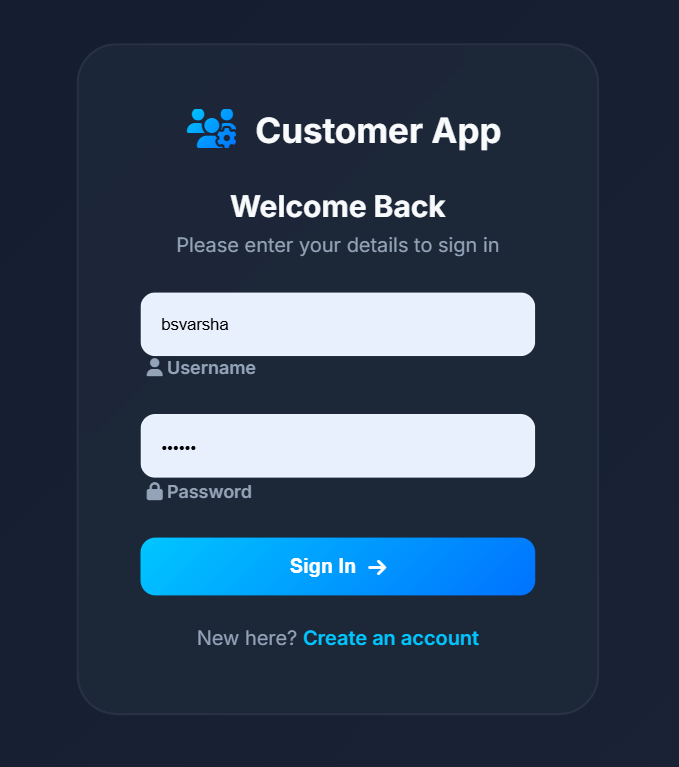
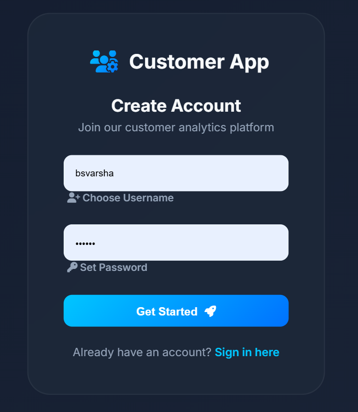

# Customer Segmentation System using K-Means Clustering

A Machine Learning based web application that segments customers into meaningful groups using the K-Means Clustering Algorithm. This project helps businesses analyze customer behavior based on Age, Annual Income, and Spending Score.

---

## 📌 Project Overview

Customer segmentation is an important strategy used by businesses to identify different types of customers and target them effectively.

This project:
- Uses **K-Means Clustering**
- Predicts customer segments
- Displays cluster analysis visually
- Provides a modern dashboard interface

---

## 🚀 Features

✅ User Login & Registration  
✅ Modern Dashboard UI  
✅ Customer Segmentation using ML  
✅ K-Means Clustering Algorithm  
✅ Cluster Prediction System  
✅ Data Visualization with Charts  
✅ Responsive Dark Theme Interface  
✅ Flask Backend Integration  

---

## 🛠️ Technologies Used

### Frontend
- HTML5
- CSS3
- JavaScript
- Chart.js
- Font Awesome

### Backend
- Python
- Flask

### Machine Learning
- Scikit-learn
- Pandas
- NumPy
- K-Means Clustering

---

## 📂 Project Structure

```bash
customer-segmentation/
│
├── app.py
├── modeltraining.ipynb
├── kmeans_model.pkl
├── scaler.pkl
├── Mall_Customers.xlsx
│
├── templates/
│   ├── login.html
│   ├── register.html
│   ├── dashboard.html
│   └── result.html
│
├── static/
│   └── style.css
│
└── README.md
```

---

## 📊 Dataset Information

Dataset Used:
- Mall Customers Dataset

Features:
- Customer ID
- Gender
- Age
- Annual Income
- Spending Score

---

## ⚙️ Machine Learning Workflow

### 1. Data Collection
Customer dataset is collected from retail/e-commerce data.

### 2. Data Preprocessing
- Handle missing values
- Encode categorical variables
- Normalize data using StandardScaler

### 3. Feature Selection
Selected features:
- Age
- Annual Income
- Spending Score

### 4. Elbow Method
Used to determine the optimal value of K.

### 5. K-Means Clustering
Customers are grouped into clusters based on purchasing behavior.

### 6. Model Saving
The trained model and scaler are saved using Pickle:
- `kmeans_model.pkl`
- `scaler.pkl`

---

## 🧠 Customer Segments

| Cluster | Segment Type |
|---------|---------------|
| 0 | Standard Customer |
| 1 | Careful Spender |
| 2 | Target Customer |
| 3 | Budget Spender |
| 4 | Sensible Spender |

---

## ▶️ How to Run the Project

### Step 1: Install Required Libraries

```bash
python -m pip install flask numpy pandas scikit-learn openpyxl
```

### Step 2: Run Flask Application

```bash
python app.py
```

### Step 3: Open Browser

```bash
http://127.0.0.1:5000
```

---

## 🔐 Login Flow

1. Register a new account
2. Login using credentials
3. Access Dashboard
4. Enter customer details
5. Predict customer segment

---

## 📈 Dashboard Features

- Customer Analysis Form
- Interactive Segment Chart
- Statistics Overview
- Professional UI Design

---

## 🎯 Future Enhancements

- Database Integration
- Real-time Analytics
- Deploy to Cloud
- Advanced Data Visualization
- AI-based Recommendation System

---

## 👨‍💻 Author

Developed as a Major Project for Machine Learning and Web Development.

---
## Screenshots
# output 1


# output 2


---

## 📄 License

This project is for educational purposes only.
